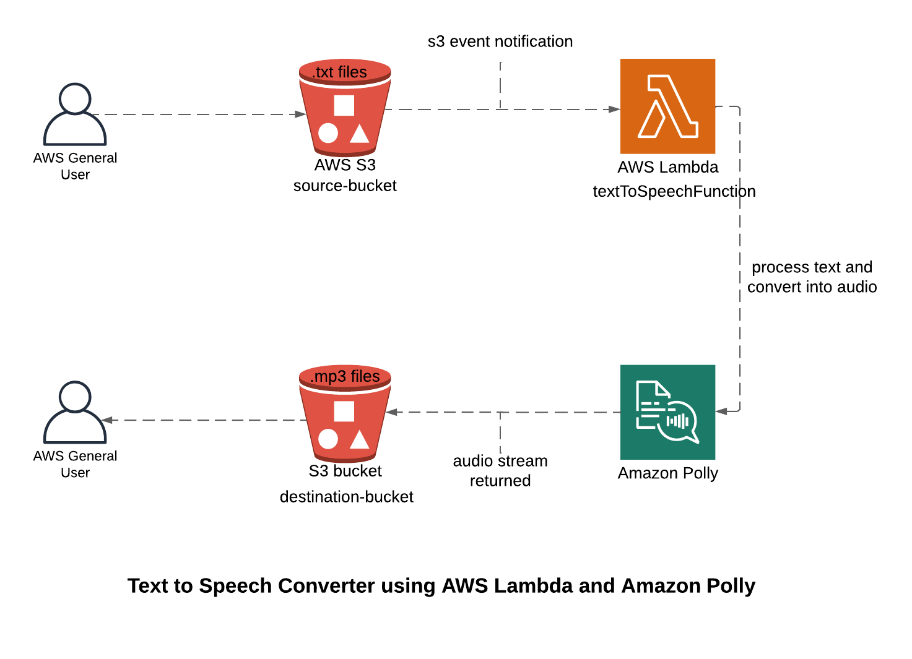

# VocalizeIt : An AWS Text-to-Speech Conversion Project

## Overview

This project is an implementation of an automated text-to-speech (TTS) conversion system using AWS services. The core components include _AWS Lambda, Amazon Polly, Amazon S3 and CloudWatch_.

## Architectural Diagram



## Setup and Configuration

### S3 Bucket Creation

1. Source S3 bucket

- Name: polly-source-bucket
- Purpose: To store text files that will be converted to speech.

2. Destination S3 bucket

- Name: polly-destination-bucket
- Purpose: To store the resulting audio (.mp3) files after conversion.


### IAM Policy Creation

- Policy Name: polly-lambda-policy
- Policy Definition:

```json
{
  "Version": "2012-10-17",
  "Statement": [
    {
      "Effect": "Allow",
      "Action": ["s3:GetObject", "s3:PutObject"],
      "Resource": [
        "arn:aws:s3:::amc-polly-source-bucket/*",
        "arn:aws:s3:::amc-polly-destination-bucket/*"
      ]
    },
    {
      "Effect": "Allow",
      "Action": ["polly:SynthesizeSpeech"],
      "Resource": "*"
    }
  ]
}
```


### IAM Role Creation

- Role Name: amc-polly-lambda-role
- Attached Policies:

1. amc-polly-lambda-policy
2. AWSLambdaBasicExecutionRole


### Lambda Function Configuration

- Function Name: TextToSpeechFunction (provided in this repo - textToSpeechFunction.py)
- Runtime: Python 3.8
- Execution Role: Attach polly-lambda-role created previously.

#### Environment Variables:

- SOURCE_BUCKET: polly-source-bucket
- DESTINATION_BUCKET: polly-destination-bucket


textToSpeechFunction.py

```python
import boto3
import json
import os
import logging

# Set up logging
logger = logging.getLogger()
logger.setLevel(logging.INFO)

def lambda_handler(event, context):
    # Initialize S3 and Polly clients
    s3 = boto3.client('s3')
    polly = boto3.client('polly')

    # Get the bucket names from environment variables
    source_bucket = os.environ['SOURCE_BUCKET']
    destination_bucket = os.environ['DESTINATION_BUCKET']

    # Get the object key from the event
    text_file_key = event['Records'][0]['s3']['object']['key']
    audio_key = text_file_key.replace('.txt', '.mp3')

    try:
        # Retrieve text from the source S3 bucket
        logger.info(f"Retrieving text file from bucket: {source_bucket}, key: {text_file_key}")
        text_file = s3.get_object(Bucket=source_bucket, Key=text_file_key)
        text = text_file['Body'].read().decode('utf-8')

        # Send text to Polly
        logger.info(f"Sending text to Polly for synthesis")
        response = polly.synthesize_speech(
            Text=text,
            OutputFormat='mp3',
            VoiceId='Joanna'  # Choose the voice you prefer
        )

        # Save the audio file to the destination S3 bucket
        if 'AudioStream' in response:
            temp_audio_path = '/tmp/audio.mp3'
            with open(temp_audio_path, 'wb') as file:
                file.write(response['AudioStream'].read())

            logger.info(f"Uploading audio file to bucket: {destination_bucket}, key: {audio_key}")
            s3.upload_file(temp_audio_path, destination_bucket, audio_key)

        logger.info(f"Text-to-Speech conversion completed successfully for file: {text_file_key}")

        return {
            'statusCode': 200,
            'body': json.dumps('Text-to-Speech conversion completed successfully!')
        }

    except Exception as e:
        logger.error(f"Error processing file {text_file_key} from bucket {source_bucket}: {str(e)}")
        return {
            'statusCode': 500,
            'body': json.dumps('An error occurred during the Text-to-Speech conversion.')
        }
```

### Event Notification Configuration

- Source Bucket: amc-polly-source-bucket
- Event Type: Object Created
- Suffix: .txt
- Destination: Lambda Function TextToSpeechFunction

### Testing the System

1. Upload a Text File: Place a .txt file in the amc-polly-source-bucket.
   
2. Verify Conversion: Check the amc-polly-destination-bucket for the corresponding .mp3 file.
   
3. Monitor Logs:
   Use AWS CloudWatch to monitor logs for the Lambda function execution and troubleshoot any issues.
   

### Monitoring and Maintenance

CloudWatch Logs: Review logs for Lambda executions to ensure everything is working as expected and to troubleshoot issues if they arise.

Cost Management: Monitor the AWS billing dashboard for any unexpected costs related to S3, Lambda, or Polly usage.

### Use Cases

The AWS text-to-speech conversion system has a wide range of practical applications across different industries. It can be used in educational platforms to convert learning materials into audio for enhanced accessibility, especially for visually impaired students. In the media and entertainment industry, it can automate the creation of audiobooks, podcasts, or voiceovers for videos. Businesses can also leverage this solution for customer service by generating automated voice responses or converting website content into speech for users. Additionally, it can be applied in content localization, translating and voicing content in multiple languages for global reach.
